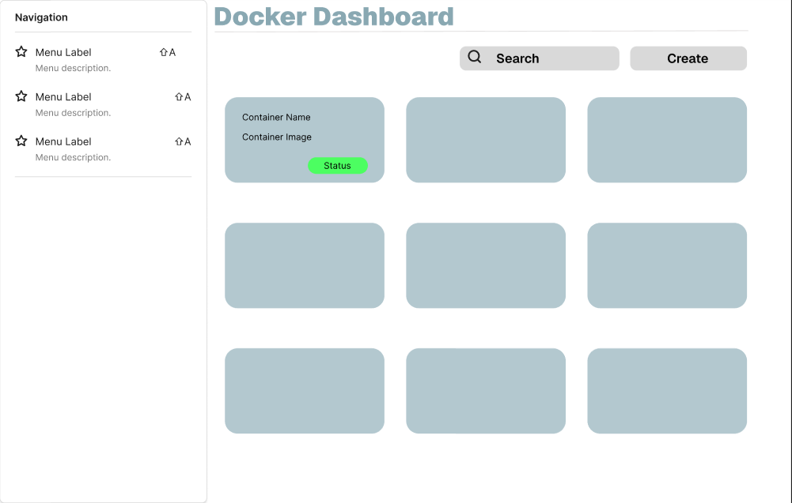
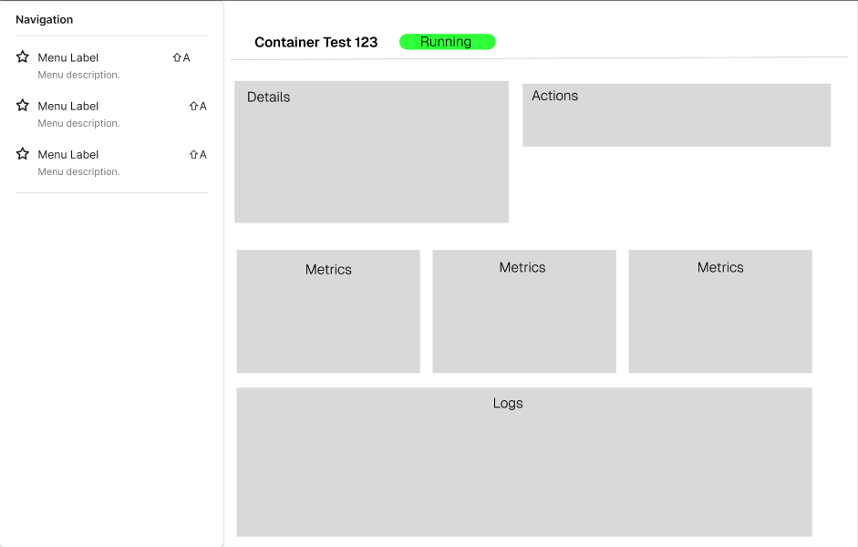
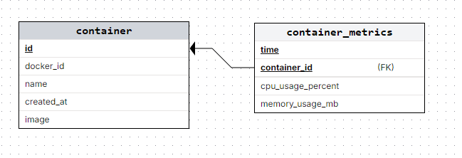

= Container Dashboard

== Ziele

* Container auf einem System sollen angezeigt werden
* Änderungen in der Anzahl und dem Status der Container sollen kontinuierlich im Dashboard auch dargestellt werden 
* Betreffend der Images sollen mögliche Updates aufgezeigt werden
* Anzeige als Webseite
* Managen von Containern
* Image Updates
* Images anzeigen
* Weitere Infos zum Container wie z.B. CPU Usage etc. darstellen
* Container Metrics speichern

== Tech Stack

* Docker API (https://docs.docker.com/reference/api/engine/version/v1.52/)
* NextJS 16 (https://nextjs.org/) mit Custom Server
* React 19
* Shadcn (https://ui.shadcn.com/) Component Library
* Socket.IO (https://socket.io/) für Real Time updates
* Recharts (https://recharts.org/) für Diagramme
* PostgresDB mit TimescaleDB plugin
* Dockerode als Docker API Client
* Tailwind CSS für Styling

== Plan
 1. NextJS setup
 2. Dockerode lernen
 3. Socket.IO setup
 4. Container anzeigen in Konsole
 5. Container darstellen mit Shadcn
 6. Realt Time Updates anzeigen mit Socket.IO
 8. Daten Speichern in DB
 9. Container Managen 
 10. Image Updates Pullen

== Design Grob

== Datenbank Schema

=== Container Tabelle
Speichert alle Container die auf dem System existieren.

[cols="1,1,2"]
|===
|Spalte |Typ |Beschreibung

|id |PRIMARY KEY |Eindeutige ID in der Datenbank
|docker_id |VARCHAR(64) UNIQUE |Docker Container ID
|name |VARCHAR(255) |Container Name
|created_at |TIMESTAMP |Zeitpunkt der Erstellung
|image |VARCHAR(255) |Docker Image Name
|===

=== Container Metrics Tabelle (Hypertable)
Speichert CPU und Memory Metriken als Zeitreihen-Daten.

[cols="1,1,2"]
|===
|Spalte |Typ |Beschreibung

|time |TIMESTAMPTZ |Zeitstempel der Messung
|container_id |INTEGER (FK) |Referenz zur Container Tabelle
|cpu_usage_percent |DOUBLE|CPU Auslastung in Prozent
|memory_usage_mb |DOUBLE|Speicherverbrauch in MB
|===

== Server Architektur

Der Custom Server (`server.js`) verwendet:

* *Next.js* für das Frontend Rendering
* *Socket.IO* für Echtzeit-Kommunikation mit dem Client
* *Dockerode* für die Kommunikation mit der Docker API
* *pg* für die PostgreSQL/TimescaleDB Verbindung

=== Socket.IO Events

[cols="1,1,2"]
|===
|Event |Richtung |Beschreibung

|`connectToClient` |Server → Client |Bestätigt die Verbindung
|`initial-containers` |Server → Client |Sendet alle Container beim Connect
|`new-container` |Server → Client |Neuer Container wurde erstellt
|`container-deleted` |Server → Client |Container wurde gelöscht
|`status-change` |Server → Client |Container Status hat sich geändert
|`percentage-data` |Server → Client |CPU Usage Daten für abonnierte Container
|`request-containers` |Client → Server |Fordert Container-Liste an
|`subscribe-container-stats` |Client → Server |Abonniert Stats eines Containers
|`unsubscribe-container-stats` |Client → Server |Beendet Stats-Abo eines Containers
|`saveStats` |Client → Server |Aktiviert/Deaktiviert Speichern in DB
|===

== Implementierte Features

=== Homepage
* Zeigt alle Docker Container als Karten an
* Container Name, Image und Status werden dargestellt
* Farbcodierte Status-Badges (grün = running, rot = exited, gelb = paused)
* Echtzeit-Updates bei Container-Änderungen via Socket.IO
* Verbindungsstatus-Anzeige (connected/disconnected)
* Toggle-Button um Metriken-Speicherung in DB zu aktivieren/deaktivieren

=== Container Detail Seite
* Erreichbar unter `/containers/[containerId]`
* Zeigt CPU-Auslastung als echtzeit Diagramm
* Updates alle 3 Sekunden
* Verwendet Recharts für die Visualisierung

=== Metriken-Streaming
* Server streamt CPU-Statistiken für laufende Container
* Client kann sich für bestimmte Container subscriben
* Daten werden in TimescaleDB gespeichert

=== Docker Events

Der Server überwacht folgende Docker Events:

* `create` - Container erstellt
* `start` - Container gestartet
* `stop` - Container gestoppt
* `die` - Container beendet
* `pause` - Container pausiert
* `destroy` - Container gelöscht

== Entwicklung

=== Voraussetzungen
* Node.js
* Docker Desktop
* TimescaleDB Container

=== Setup
[source,bash]
----
# TimescaleDB starten
docker compose up -d timescaledb

# Datenbank initialisieren
psql -h localhost -U <username> -d docker_dashboard -f init.sql

# Dependencies installieren
npm install

# Development Server starten
npm run dev
----

=== Umgebungsvariablen (.env)
[source]
----
POSTGRES_USER=<username>
POSTGRES_PASSWORD=<password>
POSTGRES_DB=docker_dashboard
NODE_ENV=development
DATABASE_URL=postgresql://<user>:<password>@localhost:5432/docker_dashboard
----

== Projektstruktur

[source]
----
docker-dashboard/
├── server.js                 # Custom Node.js Server mit Socket.IO
├── socket.ts                 # Socket.IO Client Konfiguration
├── init.sql                  # Datenbank Setup Script
├── docker-compose.yaml       # Infrastruktur-Definition
├── Dockerfile                # Container-Build
├── src/
│   ├── app/
│   │   ├── page.tsx          # Homepage mit Container-Übersicht
│   │   ├── layout.tsx        # Root Layout
│   │   ├── actions/
│   │   │   └── container.ts  # Server Actions für Docker API
│   │   │   └── db.ts         # Datenbank abfragen
│   │   └── containers/
│   │   │    └── [containerId]/
│   │   │        └── page.tsx  # Container Detail Seite
│   │   └── containerData/
│   │       └── columns.tsx      # Spalten Definition
│   │       └── data-table.tsx   # Tabellen Komponente
│   │       └── page.tsx
│   ├── components/
│   │   ├── chart-line-step.tsx        # CPU Usage Chart Komponente
│   │   ├── chart-line-step-memory.tsx # Memory Usage Chart Komponente
│   │   ├── app-sidebar.tsx
│   │   └── ui/               # Wiederverwendbare UI Komponenten
│   ├── hooks/
│   │   └── use-mobile.ts
│   └── lib/
│       └── utils.ts
├── server/
│   ├── docker.js             # Docker Client Initialisierung
│   ├── db.js                 # PostgreSQL Datenbankoperationen
│   ├── events.js             # Docker Event Monitoring
│   └── stats.js              # Container Stats Streaming
----

== Kompetenzbereiche (iPro)
=== Bereich Software

==== Analyse

*Funktionale Anforderungen sammeln und validieren:*

Die Anforderungen wurden aus eigenen Bedürfnissen als Docker-Nutzer abgeleitet. Die Kommandozeile (`docker ps`, `docker stats`) ist für regelmässiges Monitoring unübersichtlich. Daraus entstanden folgende Kernfunktionen:

* Alle Container (laufend + gestoppt) visuell darstellen
* Statusänderungen in Echtzeit anzeigen ohne Page-Reload
* CPU- und Speicherverbrauch als Diagramm visualisieren
* Container starten, stoppen, neustarten und löschen über die UI
* Metriken optional in einer Datenbank persistieren
* Metriken zusätzlich in einer Sortierbaren Tabelle anzeigen

*Analyse der Docker Engine API:*

Die Docker Engine API wurde über die Dockerode-Bibliothek analysiert, um die Möglichkeiten und Grenzen zu ermitteln. Relevante Endpunkte:

* `listContainers({all: true})` -- Alle Container auflisten
* `getContainer(id).stats({stream: true})` -- Echtzeit-Statistiken streamen
* `getEvents({filters})` -- Docker-Events abonnieren (start, die, stop, create, destroy)

Die Stats liefern rohe Systemwerte, die umgerechnet werden müssen:

* *CPU*: `(cpuDelta / systemDelta) * cpuCores * 100` ergibt Prozent
* *Memory*: `memory_stats.usage / (1024 * 1024)` ergibt MB

==== Design

*Softwaresystem-Design inkl. Datenbank:*

Das System folgt einer Client-Server-Architektur mit Echtzeit-Kommunikation via Socket.IO. Das Design besteht aus:

* *Frontend (Next.js/React)*: Rendert Container-Karten und Charts, empfängt Events über Socket.IO
* *Custom Server (server.js)*: Verbindet Next.js mit Socket.IO und Dockerode, steuert Event- und Stats-Streaming
* *Server-Module*: Aufgeteilt in `docker.js` (Client), `events.js` (Event-Monitoring), `stats.js` (Stats-Streaming), `db.js` (Datenbankzugriff)
* *Datenbank*: PostgreSQL mit TimescaleDB für Zeitreihen-Metriken (siehe Abschnitt Datenbank Schema)

Das Subscription-Modell für Stats nutzt Socket.IO Rooms: Clients abonnieren nur den Container, den sie gerade betrachten. So wird unnötiger Netzwerk-Traffic vermieden.

==== Umsetzung

*Softwaresystem entwickeln, testen und bereitstellen:*

* Frontend mit Next.js 16, React 19 und TypeScript entwickelt
* Container-Operationen als Next.js Server Actions implementiert (`src/app/actions/container.ts`) mit async/await
* Echtzeit-Charts mit Recharts (Step-Line-Charts für CPU und Memory)
* Socket.IO-basierte Live-Updates
* Stats-Streaming mit 3-Sekunden-Throttling zur Lastbegrenzung
* Datenbank-Metriken über Toggle ein-/ausschaltbar

=== Bereich Infrastruktur

==== Analyse

*Analyse der Infrastruktur-Anforderungen:*

Für den Betrieb wurden folgende Anforderungen analysiert:

* *Docker-Socket-Zugriff*: Die Anwendung muss auf den Docker-Socket des Hosts zugreifen. Unter Linux ist das `/var/run/docker.sock`, unter Windows `//./pipe/docker_engine`. Der Socket-Zugriff gewährt Kontrolle über den Host.
* *Datenbank*: Für die Speicherung der Metriken wurde Postgresql benutzt mit dem TimescaleDB plugin.
* *Deployment*: Die gesamte Infrastruktur soll mit einem einzigen Befehl startbar sein.

==== Design

*Spezifikation der containerisierten Infrastruktur:*

Die Infrastruktur wird mit Docker Compose definiert und besteht aus zwei Services:

[source,yaml]
----
services:
  docker-dashboard:
    build: .
    ports:
      - "3000:3000"
    volumes:
      - /var/run/docker.sock:/var/run/docker.sock
    depends_on:
      - timescaledb

  timescaledb:
    image: timescale/timescaledb:latest-pg17
    ports:
      - "5432:5432"
    volumes:
      - timescaledb_data:/var/lib/postgresql/data
      - ./init.sql:/docker-entrypoint-initdb.d/init.sql
----

Designentscheide:

* *Host-Socket Mount statt Docker-in-Docker*: Einfacher und performanter
* *TimescaleDB als Extension*: Kein zusätzlicher Service nötig, PostgreSQL bleibt voll nutzbar
* *Named Volume für DB-Daten*: Daten überleben Container-Neustarts
* *Init-Script via Entrypoint*: Schema wird automatisch beim ersten Start erstellt

==== Umsetzung

*Infrastruktur einrichten, testen und zur Verfügung stellen:*

Die Infrastruktur wird mit einem Befehl gestartet:

[source,bash]
----
docker compose up --build
----

Die plattformübergreifende Docker-Anbindung in `server/docker.js`:

[source,javascript]
----
const socketPath = process.platform === "win32"
    ? "//./pipe/docker_engine"
    : "/var/run/docker.sock";
----

